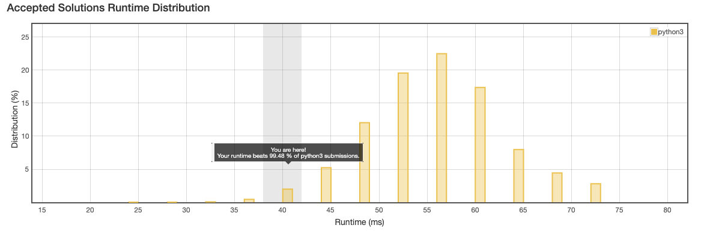
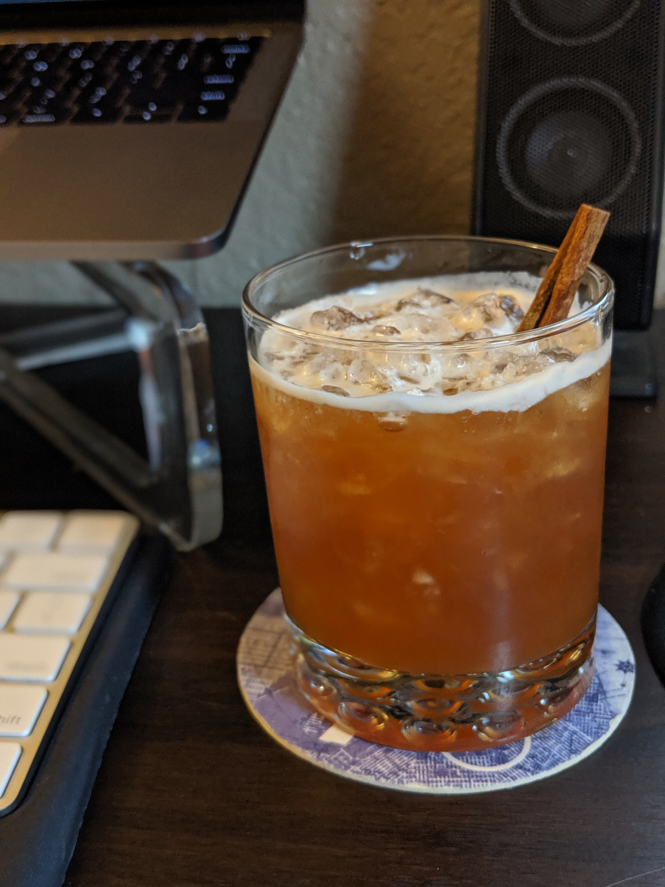
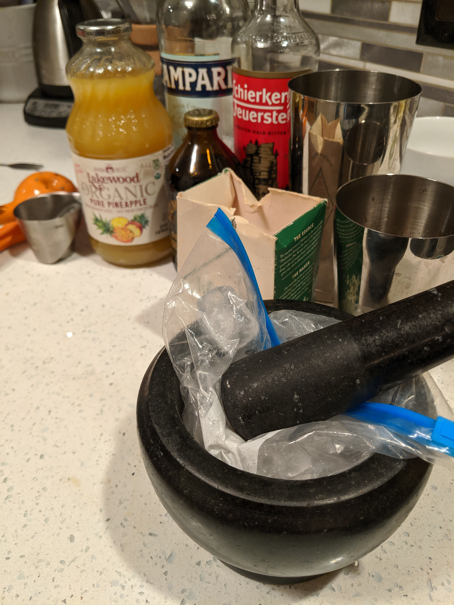

Lately I've wanted to push myself to get more handy with coding solutions and also learn more about cocktails, including their history as well as the theory and techniques needed to make them.

To this end, I'm challenging myself to regularly solve coding solutions then try making a cocktail around the same theme and writing about it. I don't expect too many parallels between the two worlds, but if there are some I'm excited to find out!

## Problem

Today's entry isn't really about Roman history. I happened to choose a coding challenge having to do with Roman numerals then decided to make a cocktail around that theme. It was pretty arbitrary - we'll try to get more creative as we go. 

The problem came from [LeetCode](https://leetcode.com/problems/roman-to-integer/) and is pretty simple. Essentially, write a function that takes as input a string containing a Roman numeral and returns the integer corresponding to that number. Reminder that the trick to Roman numerals lies in decrementing when necessary, like in `IX` which corresponds to `9` and `MCMXCIV` -> 1994, since `M = 1000`, `CM = 900`, `XC = 90` and `IV = 4`. 

I chose Python 3 because in the past I've worked mostly in Python 2 and I want to get more used to the syntax (though in this case there wasn't anything new).

### Solution

```python
SYMBOL_VALUE_MAP = {
    'I': 1,
    'V': 5,
    'X': 10,
    'L': 50,
    'C': 100,
    'D': 500,
    'M': 1000
}

class Solution:
    def romanToInt(self, s: str) -> int:
        total = 0
        last_val = 0
        for numeral in s:
            current = SYMBOL_VALUE_MAP[numeral]
            total += current
            if current > last_val:
                total -= 2*last_val
            last_val = current
        return total
```

I started with a `while` loop solution that would look ahead then changed to this one because keeping track of the indexes was annoying.

Even though it does unnecessary calculations (always adding then subtracting double if needed), I kind of like how it's a clean pass through the string. This actually ended up having pretty decent runtime compared to other solutions on LeetCode:



Memory-wise it was more or less on par with other solutions; I'm sure I could clean it up by removing some of the unnecessary variables.

### Interesting Bits

This isn't directly related to the code but I thought it was interesting. After I submitted the solution, I looked at the discussion threads and saw a post asking why their runtime was so slow. Here was the solution:

```python
class Solution:
    def romanToInt(self, s: str) -> int:
        sym_map = {'I': 1, 'V': 5, 'X': 10,
                   'L': 50, 'C': 100, 'D': 500, 'M': 1000}
        num = 0
        prev = 0
        for symbol in reversed(s):
            map_no = sym_map[symbol]
            if map_no < prev:
                num -= map_no
            else:
                num += map_no
            prev = map_no
        return num
```

I couldn't see anything off about it but wanted to check if the fact that the iterator went in reverse mattered, so I went to iPython and tested it out:

```python
In [9]: s = 'abcdefghijklmnop'

In [10]: def index_iter():
    ...:     for i in s[::-1]:
    ...:         pass
    ...:     return

In [11]: %timeit index_iter()
426 ns ± 22.2 ns per loop (mean ± std. dev. of 7 runs, 1000000 loops each)

In [12]: def reversed_iter():
    ...:     for i in reversed(s):
    ...:         pass
    ...:     return

In [13]: %timeit reversed_iter()
463 ns ± 11.2 ns per loop (mean ± std. dev. of 7 runs, 1000000 loops each)

In [14]: def no_reverse():
    ...:     for i in s:
    ...:         pass
    ...:     return

In [15]: %timeit no_reverse()
312 ns ± 12.5 ns per loop (mean ± std. dev. of 7 runs, 1000000 loops each)
```

I'm not exactly sure what under the hood would cause this difference, but it seems like it might account for some of that user's slowness!

## Cocktail

Alright, now for the cocktail! After some light googling, I came across [this recipe](https://punchdrink.com/recipes/roman-holiday/) (credit to Nandini Khaund, Cindy's in Chicago). It's based off of a Jungle Bird and called a Roman Holiday.

Here's the recipe:

```
1 ounce Amaro Meletti
1/4 ounce Campari
3/4 ounce pineapple juice
3/4 ounce lime juice
1/4 ounce demerara syrup (1:1, demerara sugar:water)
1 ounce cold-brew coffee, preferably La Colombe "Pure Black"
pinch Maldon sea salt

Garnish: cinnamon stick
```

Directions
* In a shaking tin, combine all ingredients except garnish and shake with ice.
* Strain onto a mound of crushed ice.
* Garnish with a cinnamon stick inserted between the ice and side of the glass.

### Solution

The fun part to me about making cocktails is the improvisation - it's rare that you have on hand everything in the recipe and so you often need to find suitable replacements for some of the ingredients.

In this case, I chose to use a really great German Kräuterlikör called Schierker Feuerstein in place of Amaro Meletti. Despite loving amaro, my wife and I are still working on accumulating the classics of which Meletti is certainly one. That said, we've used the Feuerstein (literally fire rock) in place of light amaro to good effect in the past.

With that, I only needed to pick up the pineapple juice and some cold-brew and I was in business. 



While I was happy with the look, taste-wise I thought it ended up being so-so. The play between the coffee and pineapple/lime was definitely interesting, but I think it overshadowed the spirits. I think next time I'll try going with a more heavy base and pulling back on some of the pineapple. 

### Interesting Bits

Aside from choosing the Meletti replacement, I had a fun time trying to follow the recipe and use crushed ice. Another difficulty in making homeade cocktails is access to good ice (normally I use storebought bags for mixing in combination with larger spheres for presentation). To get the right texture, I decided to put the ice in a ziplock bag and crush it with a mortar and pestle, which turned out pretty well!



See you next time!
